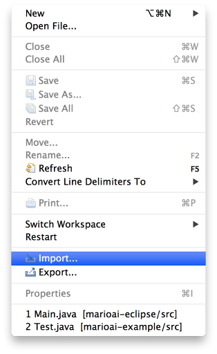

# Eclipse specific instructions

You should have something like this at this point (missing the `git remote add origin` and `git push origin master`):

Open Eclipse (hopefully you'll have some projects in there already)!

Select the 'Import…' option in the File menu:

Choose 'Existing Projects into Workspace':

Navigate to the location of your project:

If you see this, you're doing it right:

Click 'Finish' and you should see the project `marioai-eclipse` in your Package Explorer.

Open the class `Main.java` in the package `ca.uottawa`:

Click on the Run button (you must have the `Main.java` class opened at that time). And there you go, all setup like a big {girl, boy}:

