# IntelliJ specific instructions

You should have something like this at this point:

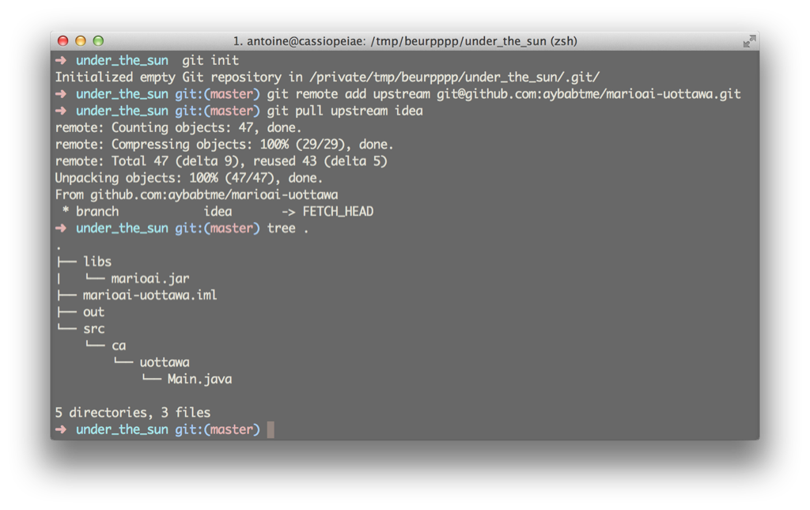

Then open IntelliJ:

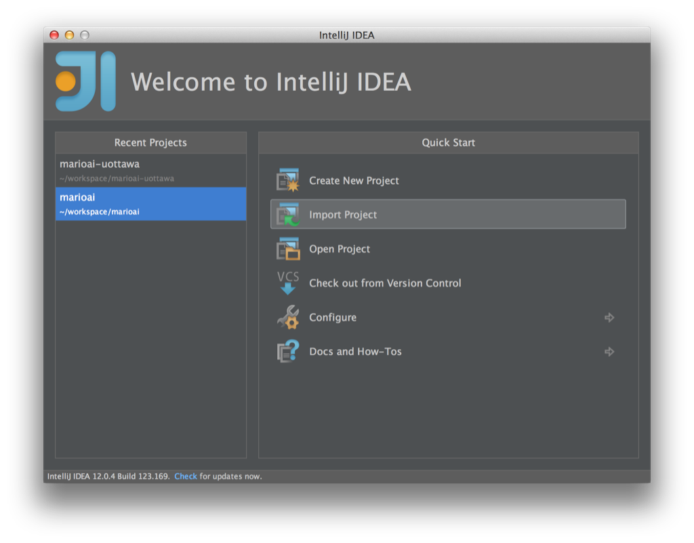

Click on 'Import Project':

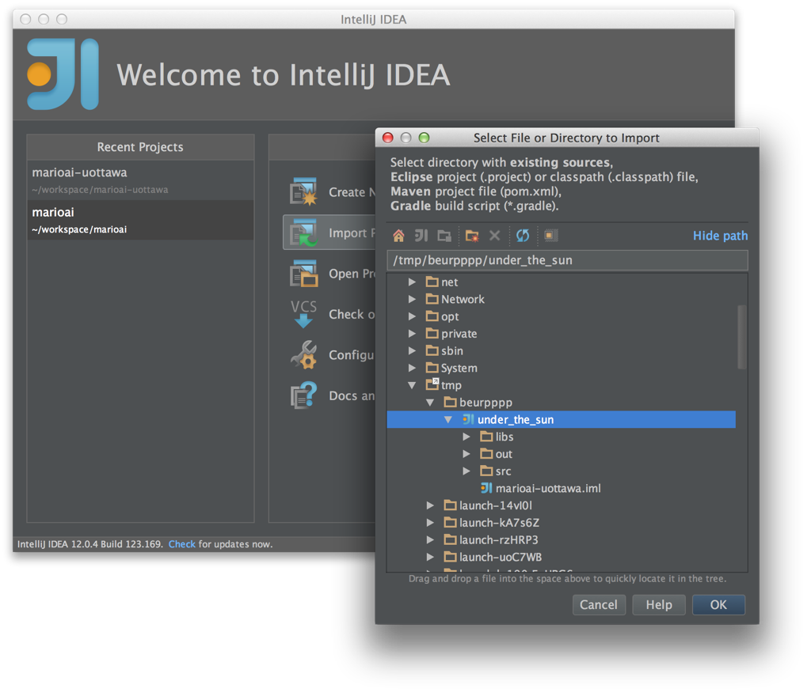

Navigate to your project path:

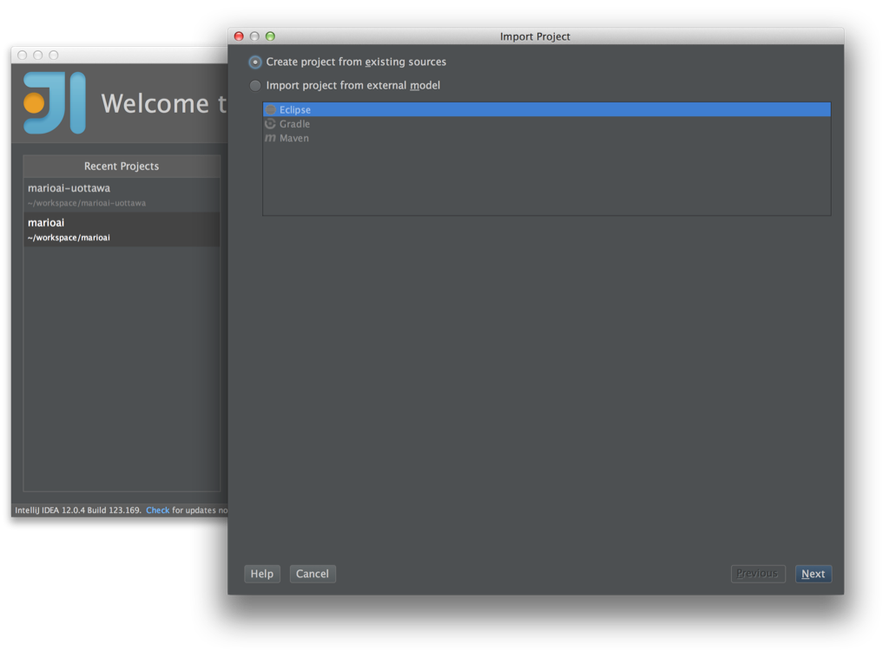

Select 'Create project from existing sources':

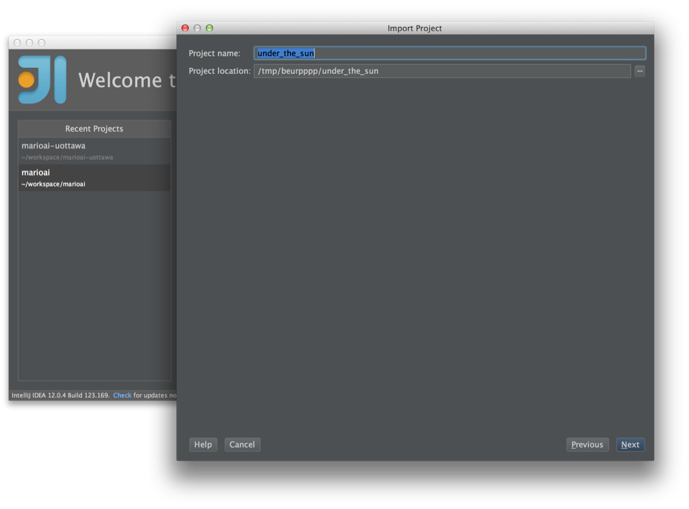

Call it whatever you like:

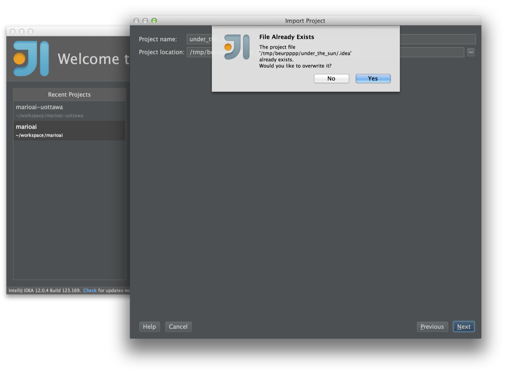

Ignore that, if you see it:

Next…

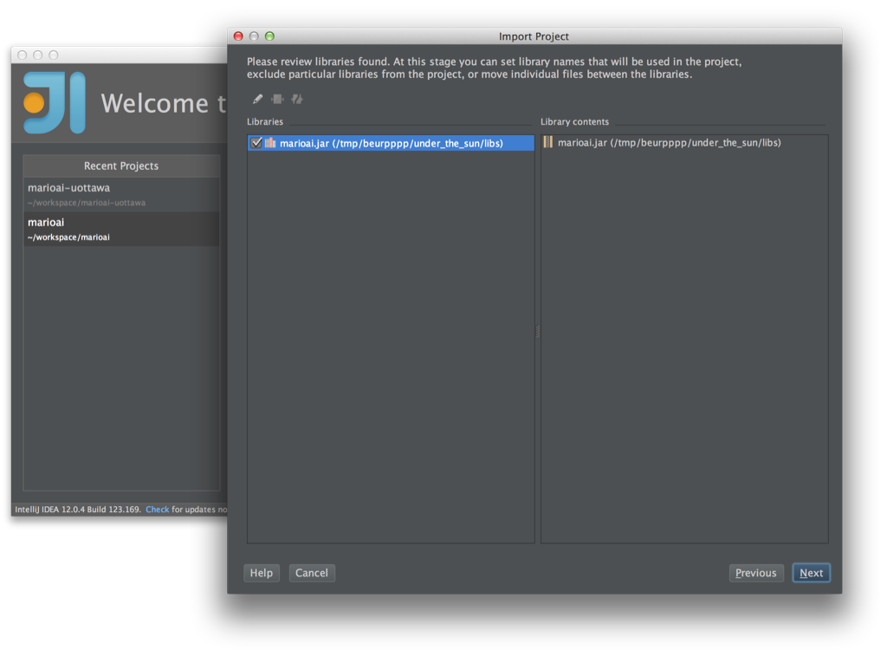

Next...

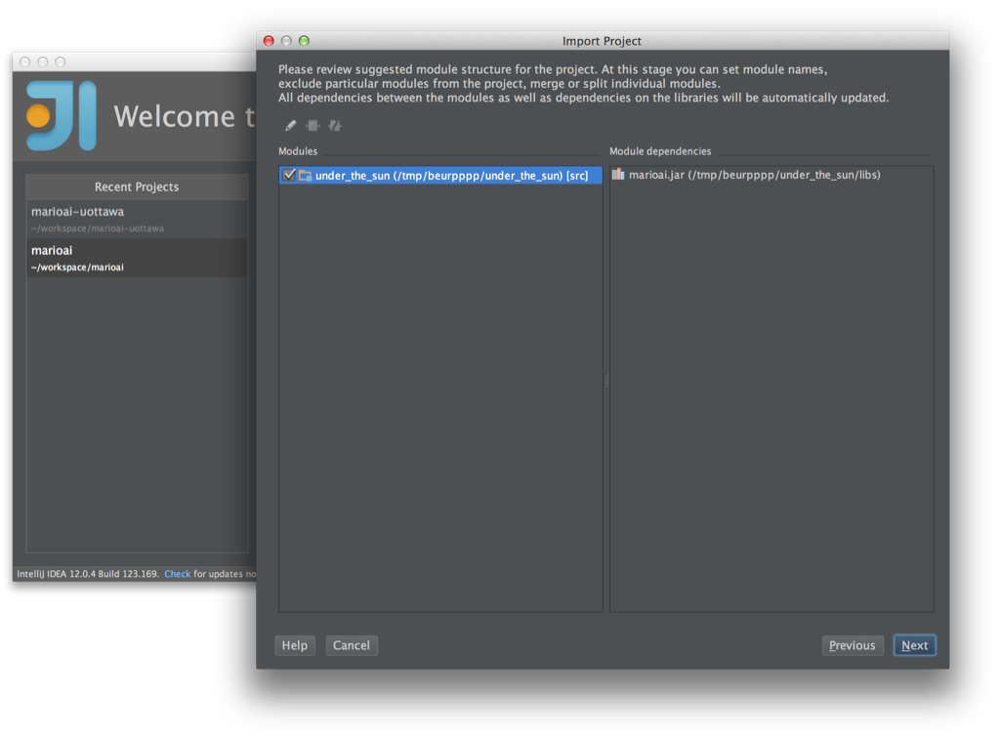

Next...

Next...

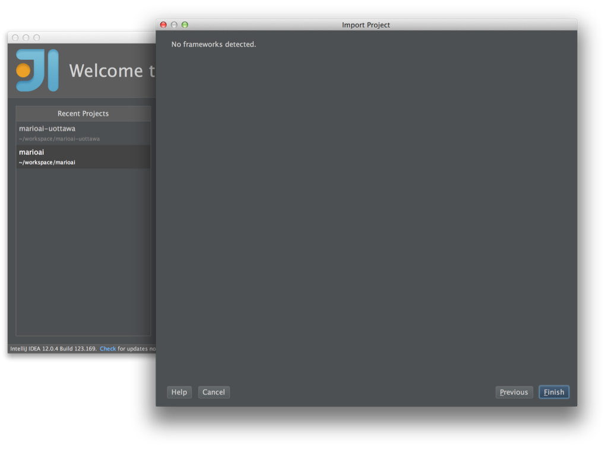

Now you have a nice project in your IDE!  You would like to run it, wouldn't you?  

Click on the 'Run' button:

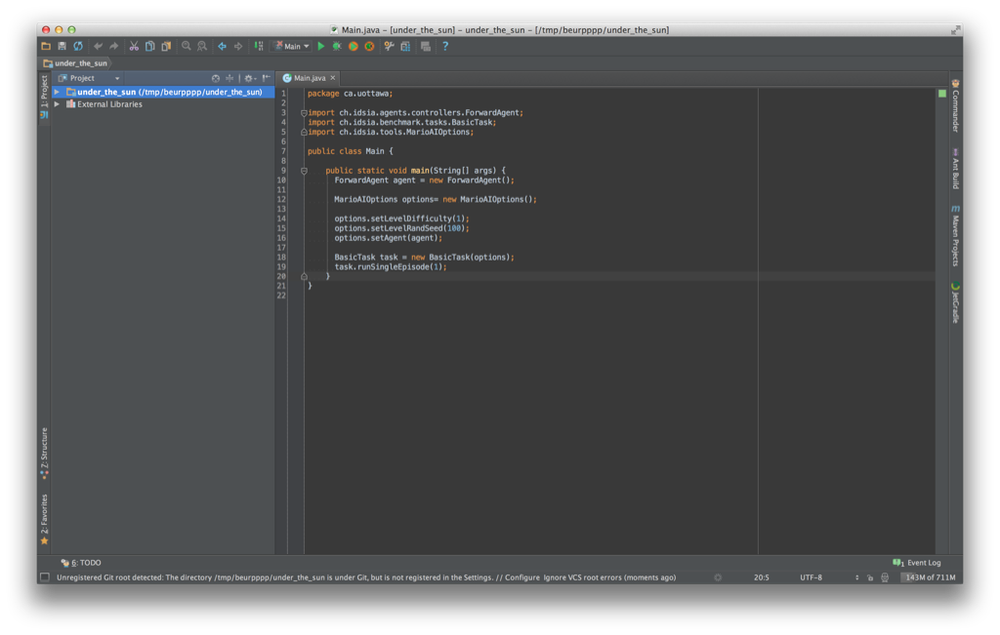

Uhoh, problem!

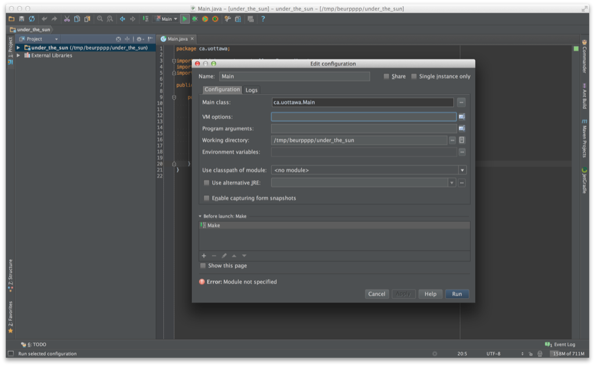

Just select the module, then click on 'Run'.

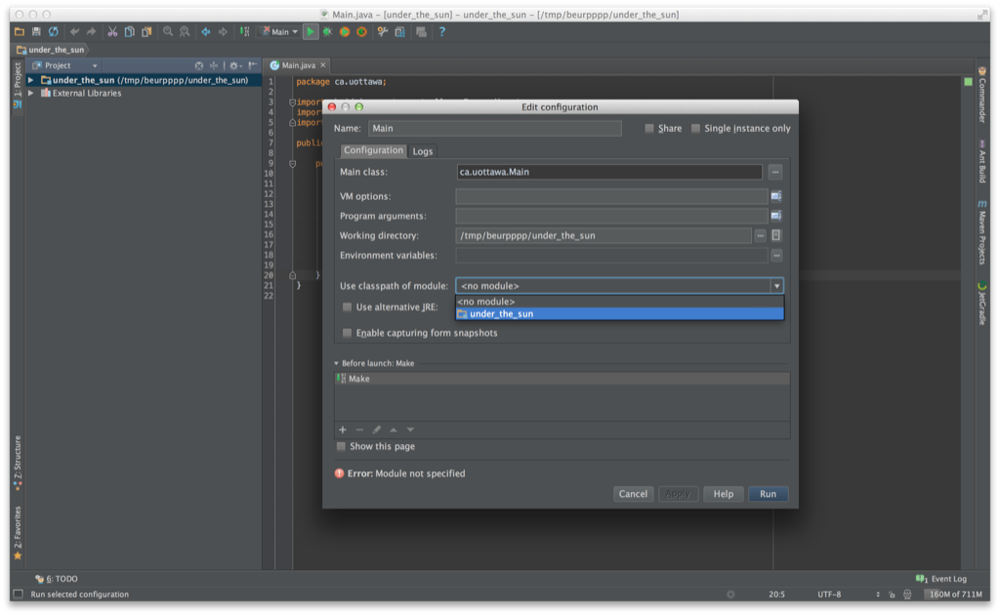

There you are, all set like a big {girl,boy}!  Call your mom and tell her about what you just did.

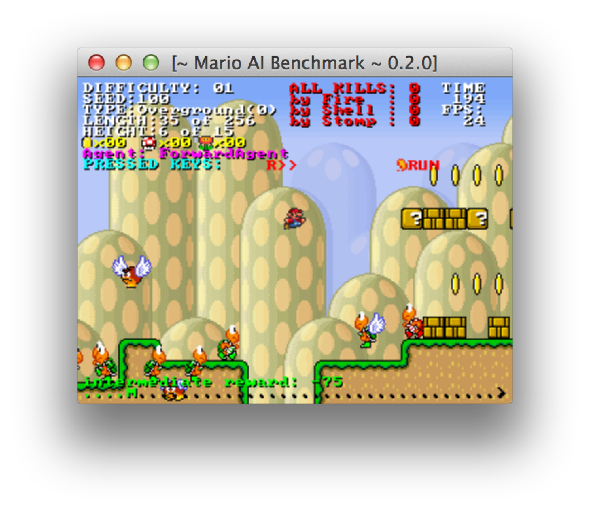
