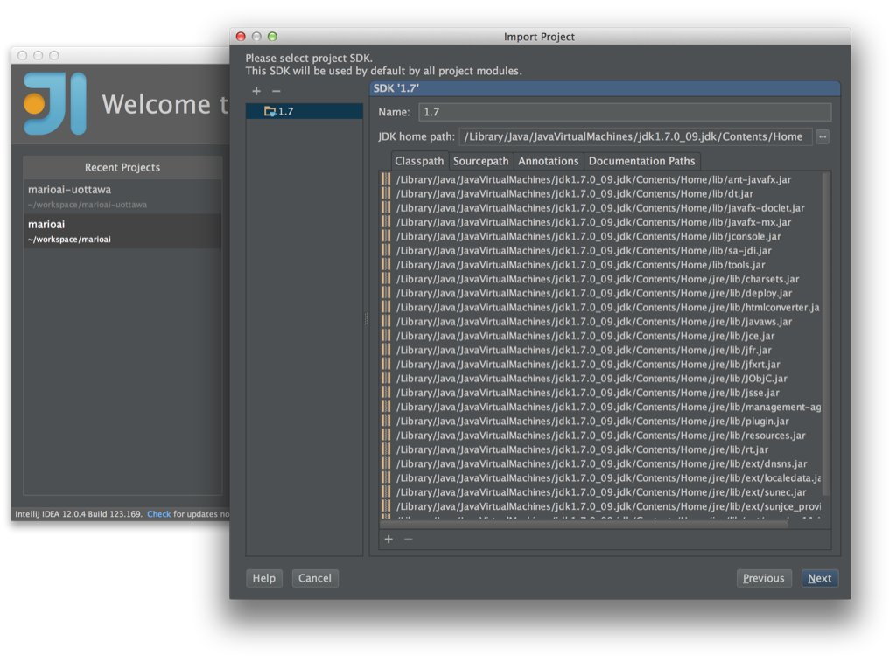

# IntelliJ specific instructions

You should have something like this at this point:

Then open IntelliJ:

Click on 'Import Project':

Navigate to your project path:

Select 'Create project from existing sources':

Call it whatever you like:

Ignore that, if you see it:

Next…

Next...

Next...

Next...

Now you have a nice project in your IDE!  You would like to run it, wouldn't you?  

Click on the 'Run' button:

Uhoh, problem!

Just select the module, then click on 'Run'.

There you are, all set like a big {girl,boy}!  Call your mom and tell her about what you just did.

